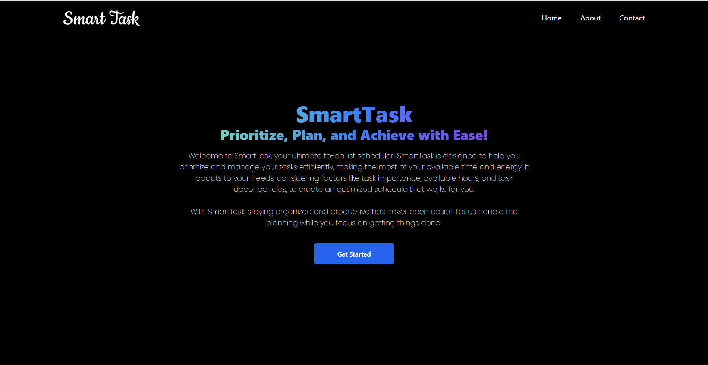
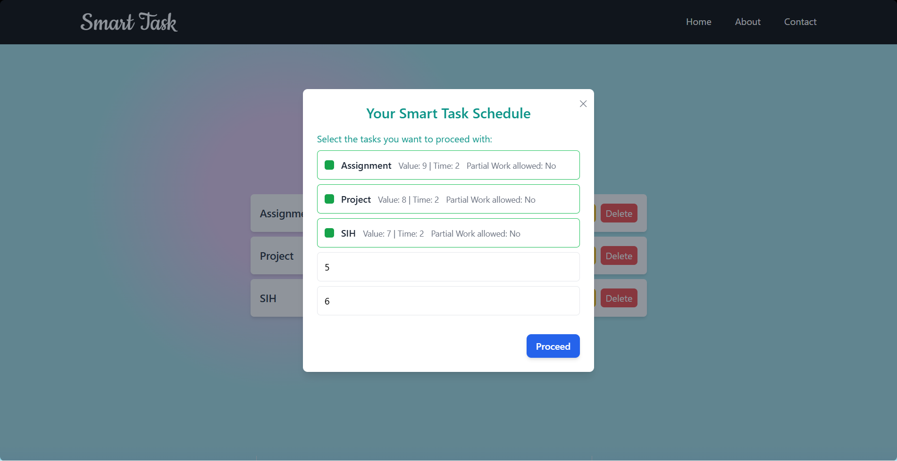
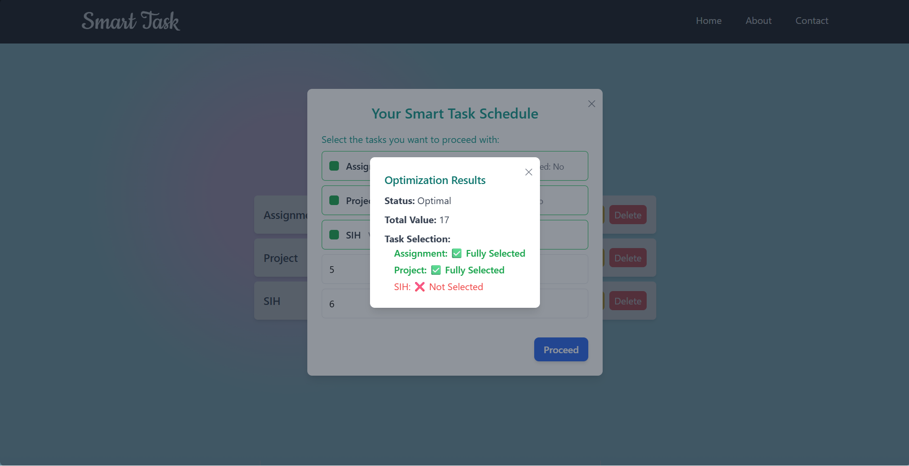
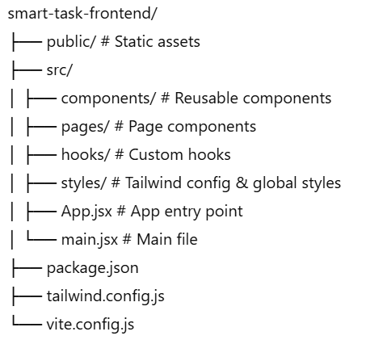

# 🌟 SmartTask – Frontend  


> **SmartTask** – Prioritize, Plan, and Achieve with Ease! 🚀  
Your intelligent **to-do list scheduler** that uses **Linear Programming** to create **optimized task schedules** tailored to your productivity.

---

## 📌 Live Demo  
🔗 **[SmartTask Frontend](https://rajshakya0101.github.io/smart-task-frontend/)**  

---

## ✨ Features
- 📝 Add, edit, and delete your tasks seamlessly  
- 🧠 Uses **Linear Programming (LPP)** for **task optimization**  
- 📅 Automatically generates the **best schedule** based on priorities  
- 🎨 **Beautiful UI** built with **React + Tailwind CSS**  
- 📱 Fully **responsive** and optimized for all devices  
- 🚀 Deployed on **Vercel** for fast performance  

---

## 🖼️ Screenshots  

### **Landing Page**  


### **Task List**  


### **Task Optimization**  


### **Task Result**  


---

## 🛠️ Tech Stack
- **Frontend Framework**: [React](https://reactjs.org/)
- **UI Styling**: [Tailwind CSS](https://tailwindcss.com/)
- **Deployment**: [Vercel](https://vercel.com/)
- **Backend API**: [Flask](https://flask.palletsprojects.com/) (Hosted on Render)

---

## 📂 Folder Structure


---

## ⚡ Installation & Setup

```bash
# Clone the repository
git clone https://github.com/Rajshakya0101/smart-task-frontend.git

# Navigate to the project folder
cd smart-task-frontend

# Install dependencies
npm install

# Start development server
npm run dev

# Build for production
npm run build

```

🚀 Usage

Open SmartTask in your browser

Add your tasks with name, priority, and duration

Hit "Get SmartTask Schedule"

Sit back and watch your optimized schedule appear ✨

📡 API Integration

This frontend connects to the SmartTask Backend API for optimization calculations:
🔗 SmartTask Backend Repo

---

👨‍💻 Author

Raj Shakya
📧 rajshakya.orai18@gmail.com

🌐 [LinkedIn](https://www.linkedin.com/in/raj-shakya-8b205225b/)
 | GitHub